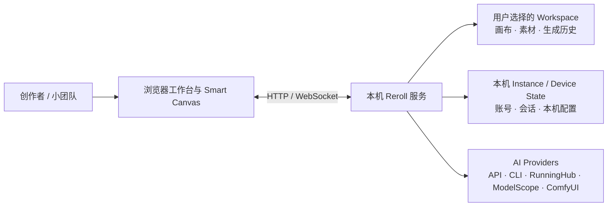

# Reroll AI Canvas

> 面向图片与视频生成的本地优先 AI 无限画布工作台。
> 在一张可协作的画布里组织提示词、参考素材、生成流程与结果。

**Local-first AI canvas for image and video generation, visual workflows, asset management, and small-team collaboration.**

[](https://github.com/lazyq666/reroll-ai-canvas/actions/workflows/public-readiness.yml)

[快速开始](#快速开始) · [产品导览](#产品导览) · [为什么选择-reroll](#为什么选择-reroll) · [文档](#文档) · [参与贡献](#参与贡献)

<!-- IMAGE PLACEHOLDER: HERO / 1600x900 / 展示完整 Smart Canvas 工作区、节点关系与生成结果 -->
> **配图占位｜Hero，建议 1600 × 900**
>
> 展示完整 Smart Canvas：提示词节点、参考图片、生成节点、视频结果、Frame 与左侧工作台导航。

> [!NOTE]
> Reroll AI Canvas 使用带非商业限制的源码公开许可（source-available），不是 OSI 定义的开源软件。使用、分发或二次开发前请阅读 [LICENSE](LICENSE)。

> [!IMPORTANT]
> 本项目基于 [hero8152/Infinite-Canvas](https://github.com/hero8152/Infinite-Canvas) 修改开发，是独立维护的非官方衍生版本。原作者、原项目链接、版权声明与许可要求均予以保留。

---

## 什么是 Reroll AI Canvas

Reroll AI Canvas 把 AI 图片与视频创作从“一个提示词输入框”扩展成可观察、可整理、可复用的视觉工作流。

你可以在同一张 Smart Canvas 中放入提示词、图片、视频、音频与文字参考，通过节点连接组织生成关系；生成结果会回到画布和工作区资产库，而不是散落在不同平台的历史记录里。

项目采用本地优先的数据方式：应用服务运行在自己的电脑上，画布与素材保存在用户选择的 Workspace；只有调用在线模型时，相关请求才会发送到所配置的 AI 服务商。

Reroll 面向个人创作者和可信的小团队，重点解决四件事：

- **视觉化生成流程**：把提示词、参考素材、模型设置和生成结果放在同一空间里。
- **接近设计工具的画布交互**：提供指针、抓手、框选、多选、Frame、Smart Group、右键菜单和快捷键。
- **本地优先的素材与配置管理**：Workspace、资产库、生成历史和可迁移的 API 设置由用户掌控。
- **小团队协作**：提供账号、角色、画布权限、只读分享与 Smart Canvas 实时同步。

---

## 产品导览

### 核心页面

| 工作台与项目入口 | Smart Canvas 创作空间 |
| --- | --- |
| **配图占位｜建议 1440 × 900**<br>展示工作台首页、画布列表、最近项目和主要功能入口。 | **配图占位｜建议 1440 × 900**<br>展示多种节点、Frame、连线、右键菜单和生成结果。 |

<!-- IMAGE PLACEHOLDER: WORKBENCH / 1440x900 -->
<!-- IMAGE PLACEHOLDER: SMART CANVAS / 1440x900 -->

| API 与模型管理 | Workspace 资产库 |
| --- | --- |
| **配图占位｜建议 1440 × 900**<br>展示平台、协议、模型能力和密钥配置，不要在截图中暴露真实 Key。 | **配图占位｜建议 1440 × 900**<br>展示素材文件夹、批量导入、搜索、预览和拖入画布。 |

<!-- IMAGE PLACEHOLDER: MODEL SETTINGS / 1440x900 -->
<!-- IMAGE PLACEHOLDER: ASSET LIBRARY / 1440x900 -->

### 1 · 在画布上组织生成流程

- 支持图片、视频、音频、文字、提示词、生成、批处理、Frame 与 Smart Group 等节点。
- 通过 Connection 表达输入、参考和结果之间的关系。
- 支持选择、框选、多选、拖动、缩放、平移、复制、撤销和右键操作。
- 远景缩放时自动简化媒体与节点细节，让大型画布仍能作为结构地图使用。

<!-- IMAGE PLACEHOLDER: VISUAL WORKFLOW / 1600x900 / 展示“参考图 → 提示词 → 图片生成 → 视频生成”完整链路 -->
> **配图占位｜Visual workflow，建议 1600 × 900**
>
> 推荐展示一条可读的端到端链路：参考图 → 提示词 → 图片生成 → 视频生成 → 结果归档。

### 2 · 连接图片、视频与工作流模型

Reroll 以 API 调用为主要方向，同时保留 CLI、本地工作流与原项目兼容能力。不同服务商的请求、状态、结果和错误会收敛到统一的 Generation Run 流程中。

当前接入面包括：

- OpenAI 兼容协议、Gemini、火山引擎及其他 HTTP API；
- APIMART、RunningHub、ModelScope；
- 即梦 CLI、Gemini / Antigravity CLI；
- 本地或局域网 ComfyUI 工作流；
- Codex CLI 的 GPT Image 2 helper（可选安装）。

模型、地区、计费和内容规则由相应服务商决定。完整生成链路见[生成链路文档](docs/current/generation-pipeline.md)。

### 3 · 管理 Workspace 与创作素材

- 用户自行选择 Workspace；它必须与 Git 源码仓库使用互不包含的独立目录，画布、素材和生成结果不会写入源码目录。
- 资产库支持素材发现、文件夹分类、批量导入、搜索和复用。
- 工作区内容可以迁移到其他目录或设备。
- 在 API 设置页的「API 与模型备份」统一导出密码加密包，迁移平台连接、API 密钥和所有模型的名称、排序、显隐及能力详情；包含 CLI 模型设置，CLI 登录需在目标设备重新完成。支持旧包导入。详见[备份与恢复说明](docs/current/api-settings-package.md)。
- 账号与会话属于当前安装，不会因为切换 Workspace 而退出或改变角色。

### 4 · 与小团队共同编辑

- 内置管理员、设计师和访客角色，以及账号申请、审核和禁用流程。
- 画布可设为私有或共享，并可创建随时撤销的只读分享链接。
- Smart Canvas 使用服务端权威 Revision 和结构化 Mutation 同步，避免“最后保存的人覆盖所有人”。
- 当前产品体验与正式容量验收以同一画布 **10 名实时协作者**为目标。

> 当前协作定位是可信小团队和单服务实例，不是大型互联网多租户 SaaS。容量、连接上限与已知风险见[实时协作性能与容量](docs/current/realtime-collaboration-performance.md)。

---

## 为什么选择 Reroll

Reroll 没有试图替代原项目，而是在其创作能力之上，进一步加强了画布交互、团队协作、API 工作流和本地数据边界。

| 方向 | 原项目 | Reroll AI Canvas |
| --- | --- | --- |
| 创作方式 | 功能丰富的 AI 无限画布 | 进一步强调可读的视觉工作流与设计工具式交互 |
| 使用场景 | 更适合单机、单人创作 | 增加多账号、画布权限、只读分享和小团队实时协作 |
| 模型接入 | API、ModelScope、即梦 CLI、ComfyUI | 保留兼容能力，并统一平台、模型与 Generation Run 管理 |
| 数据管理 | 以当前设备内的数据和配置为主 | 增加可选择 Workspace、资产库和加密配置迁移 |
| 启动维护 | 各平台独立脚本 | 提供统一的跨平台环境检查、依赖安装和启动入口 |

### 设计原则

- **Canvas first**：工作流首先应该在空间关系上可读，而不是只存在于表单和日志里。
- **Local first**：创作文件和工作区由用户选择位置，在线模型只是可替换的执行端。
- **API first, not API only**：优先统一 API，同时保留 CLI、RunningHub、ModelScope 与 ComfyUI。
- **Small-team ready**：权限、分享和同步是产品能力，不依赖共享同一台电脑。
- **Recoverable by default**：网络重试、迟到结果和断线恢复不应重复计费或复活已删除节点。

---

## 快速开始

无需预先安装 Python。首次启动时，统一启动器会按需准备 Reroll 专用的 Python 3.12 环境、创建虚拟环境并安装锁定版本的依赖；它不会覆盖系统 Python。

### Windows 10/11

双击：

```text
启动服务-Windows.bat
```

### macOS

首次使用时右键打开，以后可直接双击：

```text
启动服务-macOS.command
```

### Linux 或终端

```bash
bash 启动服务-macOS.command
```

启动完成后访问 `http://127.0.0.1:3000/`。如果 3000 端口已被占用，启动器会自动尝试 3001、3002 等后续端口。

启动器会在服务运行期间持续监督后端。建议在原启动窗口按 `Ctrl+C` 停止；关闭启动窗口、终端标签页或外层启动任务时，后端也会检测到监督关系断开并完成安全清理，包括释放端口与 Workspace 使用权。不要绕过统一启动入口直接运行后端，否则工作区切换等受控重启无法由启动器接续。

### 首次设置

1. 创建本机管理员账号。
2. 选择一个 Workspace 父目录。
3. 配置需要使用的 AI 平台与模型。
4. 新建或打开 Smart Canvas，拖入参考素材并开始连接工作流。

> 首次启动需要联网下载运行环境和依赖。AI 生成是否需要联网，取决于你使用在线 API 还是本地 ComfyUI。

### 环境检查与依赖修复

```bash
# Windows
启动服务-Windows.bat check
启动服务-Windows.bat install --force

# macOS / Linux
./启动服务-macOS.command check
./启动服务-macOS.command install --force
```

---

## 工作方式



- **前端**可以理解为用户看到和操作的界面：工作台、Smart Canvas、设置页与资产库。
- **后端**是运行在本机的服务层：负责权限、数据保存、协作同步和调用模型。
- **Workspace**保存可迁移的创作内容；账号、会话和设备设置保留在当前安装中。
- **Provider adapter**把不同 AI 平台的请求方式转换成 Reroll 统一的生成任务状态。

更完整的产品边界、技术栈和代码阅读入口见[项目地图](docs/PROJECT-MAP.md)。

---

## 数据、安全与部署边界

- 服务默认监听 `0.0.0.0`，同一局域网内的设备可以通过启动器显示的局域网地址访问；修改监听配置后需要重启服务。
- 如需仅允许本机访问，可在项目 `.env` 中设置 `INFINITE_CANVAS_HOST=127.0.0.1`。
- 局域网访问不等于公网部署；只应在可信网络中开放，并继续使用 Reroll 的账号与权限控制。完整的监听、重启、防火墙和失败恢复规则见[本机与局域网访问](docs/current/local-network-access.md)。
- 公网部署需要自行配置 HTTPS 反向代理、安全 Cookie、可信访问边界和备份策略。
- 当前协作服务按单个 Uvicorn Worker 设计，不支持多 Worker、多实例或跨服务器同步。
- API Key、账号数据、分享令牌和用户素材有不同存储边界，详见[存储路径与旧数据迁移](docs/current/storage-layout-and-migration.md)。
- 管理员在“可用模型管理”每个模型的“编辑”中维护能力；同一 Model ID 的选择会原子应用到关联平台。API 设置页拉取模型时，对 Dreamina、Gemini API 与 APIMART 顺带提取明确能力资料和待核对建议，失败不影响模型清单；没有独立检查入口、启动或定时资料采集。外部 AI 查找与能力数据导入已移除，能力缺口由管理员在模型详情中人工维护；已保存数据与来源记录继续保留。详见[模型能力说明](docs/active/2026-09-04-model-capability-catalog.md)。
- 安全问题请不要公开披露，按 [SECURITY.md](SECURITY.md) 中的私密报告方式提交。

---

## 已知边界

- 主要面向桌面浏览器，不承诺手机端或其他移动端布局。
- 适合个人与可信小团队，不是成熟的互联网多租户 SaaS。
- 当前不支持多 Worker、多实例和跨服务器协作。
- 暂无完整的评论、跟随视角和长期版本历史系统。
- Workspace 可以借助 OneDrive 等工具跨设备同步，但 Reroll 不负责第三方同步服务产生的文件冲突。
- AI 服务的可用性、模型能力、价格和内容规则取决于各上游服务商。

---

## 文档

- [产品知识库](docs/README.md)：按角色查找产品、系统、功能规格与生命周期资料。
- [项目地图](docs/PROJECT-MAP.md)：产品边界、技术栈、系统结构、功能覆盖和代码入口。
- [UI 设计与交互指南](docs/current/ui-design-guidelines.md)：界面原则、组件状态和验收清单。
- [生成链路](docs/current/generation-pipeline.md)：Generation Run、服务商适配、结果写回与恢复。
- [Workspace 资产库](docs/current/workspace-asset-library.md)：素材发现、管理、本地引用与容量边界。
- [实时协作性能与容量](docs/current/realtime-collaboration-performance.md)：10 人目标、连接上限与性能 Gate。
- [公开项目身份](docs/current/public-project-identity.md)：品牌、仓库命名、许可定位与兼容标识。

---

## 参与贡献

欢迎提交 Bug、需求、文档修正与实现建议：

- 提交前先搜索[已有 Issues](https://github.com/lazyq666/reroll-ai-canvas/issues)，避免重复。
- Bug 请尽量提供可复现步骤、系统和浏览器版本；截图中不要包含 API Key、Cookie、私网地址或本机绝对路径。
- 开始编码前请阅读[贡献指南](CONTRIBUTING.md)和项目根目录的 `AGENTS.md`。
- 用户可见文案需要同时提供中文与英文，并接入共享 i18n 资源。

---

## 原项目、作者与传承

- 原项目：[hero8152/Infinite-Canvas](https://github.com/hero8152/Infinite-Canvas)
- 原作者 GitHub：[hero8152](https://github.com/hero8152)
- 原作者 Bilibili：[78652351](https://space.bilibili.com/78652351)
- 原项目视频教程：[YouTube](https://youtu.be/r_y_9ALr7fg)
- 原项目配套 Chrome 插件：[Chrome Web Store](https://chromewebstore.google.com/detail/ajfhnbklbmpfaaookhfakohabnpmlcic)

感谢原作者公开完整项目，为无限画布、模型调用、素材管理与创作工具提供了核心基础。如果问题只出现在 Reroll 衍生版本中，请优先在本仓库反馈，避免给原作者增加与其代码无关的排查负担。

---

## 许可

本项目沿用仓库中的 [LICENSE](LICENSE) 及原项目声明：

- 禁止将项目修改、封装后作为商业产品；商业使用须取得相应授权。
- 基于本项目二次开发的软件必须继续公开源码并注明来源作者。
- 二次开发时应同时保留原作者 `hero8152`、原项目链接，以及 Reroll 衍生版本的修改来源。

这是一份带非商业限制的源码公开许可，不是 MIT、Apache-2.0 等标准 OSI 开源许可证。随仓库分发的第三方代码、字体、图标和服务标识继续适用各自条款，详见[第三方声明](THIRD_PARTY_NOTICES.md)。许可解释以 [LICENSE](LICENSE) 和原项目权利人的说明为准。

<!-- Synthetic stale-base acceptance fixture. -->
